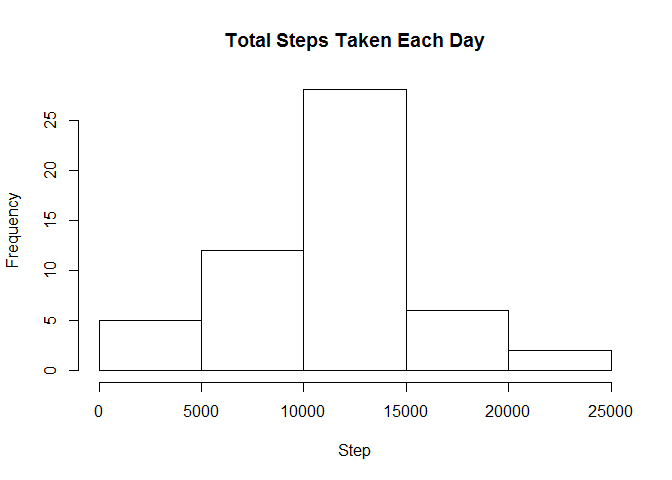
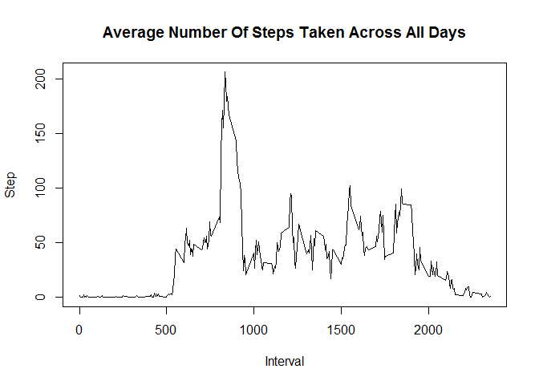
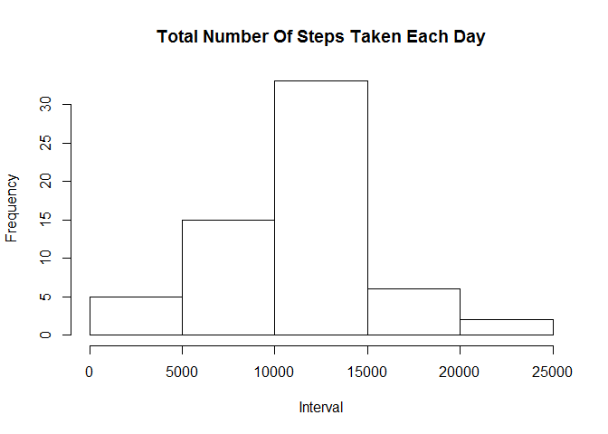
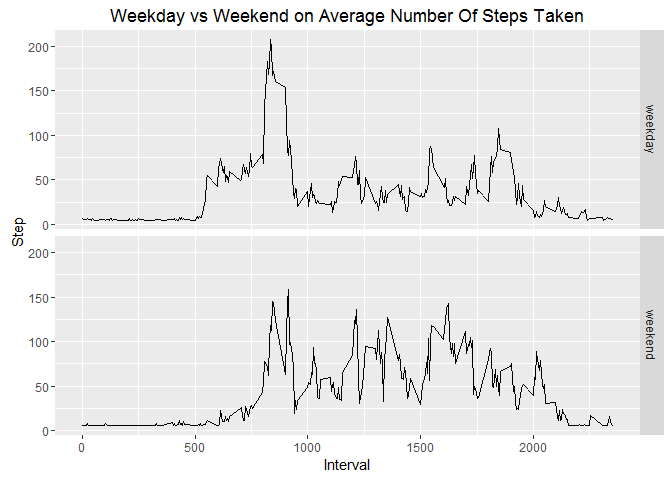

# Reproducible Research: Peer Assessment 1


## Loading and preprocessing the data

Step 1: Load required libraries


```r
library(lubridate)
```

```
## Warning: package 'lubridate' was built under R version 3.3.1
```

```
## 
## Attaching package: 'lubridate'
```

```
## The following object is masked from 'package:base':
## 
##     date
```

```r
library(ggplot2)
```

```
## Warning: package 'ggplot2' was built under R version 3.3.1
```
Step 2: Load the data


```r
activityDataSet <- read.table("activity.csv", sep=",", header=TRUE, na.strings="NA", comment.char="", stringsAsFactors = FALSE)
```

Step 3: Process/transform the data into a format suitable for analysis


```r
# Update "date" variable into date data type
activityDataSet$date <- ymd(activityDataSet$date)
```

## What is mean total number of steps taken per day?

1. Calculate total number of steps taken per day


```r
aggr <- aggregate(x=activityDataSet$steps, by=list(Category=activityDataSet$date), FUN=sum)
colnames(aggr) <- c("date", "step")
aggr
```

```
##          date  step
## 1  2012-10-01    NA
## 2  2012-10-02   126
## 3  2012-10-03 11352
## 4  2012-10-04 12116
## 5  2012-10-05 13294
## 6  2012-10-06 15420
## 7  2012-10-07 11015
## 8  2012-10-08    NA
## 9  2012-10-09 12811
## 10 2012-10-10  9900
## 11 2012-10-11 10304
## 12 2012-10-12 17382
## 13 2012-10-13 12426
## 14 2012-10-14 15098
## 15 2012-10-15 10139
## 16 2012-10-16 15084
## 17 2012-10-17 13452
## 18 2012-10-18 10056
## 19 2012-10-19 11829
## 20 2012-10-20 10395
## 21 2012-10-21  8821
## 22 2012-10-22 13460
## 23 2012-10-23  8918
## 24 2012-10-24  8355
## 25 2012-10-25  2492
## 26 2012-10-26  6778
## 27 2012-10-27 10119
## 28 2012-10-28 11458
## 29 2012-10-29  5018
## 30 2012-10-30  9819
## 31 2012-10-31 15414
## 32 2012-11-01    NA
## 33 2012-11-02 10600
## 34 2012-11-03 10571
## 35 2012-11-04    NA
## 36 2012-11-05 10439
## 37 2012-11-06  8334
## 38 2012-11-07 12883
## 39 2012-11-08  3219
## 40 2012-11-09    NA
## 41 2012-11-10    NA
## 42 2012-11-11 12608
## 43 2012-11-12 10765
## 44 2012-11-13  7336
## 45 2012-11-14    NA
## 46 2012-11-15    41
## 47 2012-11-16  5441
## 48 2012-11-17 14339
## 49 2012-11-18 15110
## 50 2012-11-19  8841
## 51 2012-11-20  4472
## 52 2012-11-21 12787
## 53 2012-11-22 20427
## 54 2012-11-23 21194
## 55 2012-11-24 14478
## 56 2012-11-25 11834
## 57 2012-11-26 11162
## 58 2012-11-27 13646
## 59 2012-11-28 10183
## 60 2012-11-29  7047
## 61 2012-11-30    NA
```
2. Make a histogram of the total number of steps taken each day


```r
hist(aggr$step, breaks=5, main="Total Steps Taken Each Day", xlab="Step")
```

<!-- -->
3. Calculate and report the mean and median of the total number of steps taken per day


```r
uncleanDataMean <- as.integer(mean(aggr$step, na.rm=TRUE))
uncleanDataMedian <- as.integer(median(aggr$step, na.rm=TRUE))
```
- The calculated mean is **10766**
- The calculated median is **10765**

## What is the average daily activity pattern?

1. Make a time series plot (i.e. type = "l") of the 5-minute interval (x-axis) and the average number of steps taken, averaged across all days (y-axis)


```r
aggr <- aggregate(x=activityDataSet$steps, by=list(Category=activityDataSet$interval), FUN=mean, na.rm=TRUE)
colnames(aggr) <- c("interval", "step")
plot(aggr$interval, aggr$step, type="l", main="Average Number Of Steps Taken Across All Days", xlab="Interval", ylab="Step")
```

<!-- -->
2. Which 5-minute interval, on average across all the days in the dataset, contains the maximum number of steps?


```r
maxStepsInterval <- aggr[aggr$step==max(aggr$step),]
```
- The interval containing maximum number of steps is **835**  

## Imputing missing values

1. Calculate and report the total number of missing values in the dataset (i.e. the total number of rows with NAs)


```r
totalRowsWithNA <- sum(is.na(activityDataSet$steps))
```

- Total number of rows with NAs is **2304**  

2. Devise a strategy for filling in all of the missing values in the dataset. The strategy does not need to be sophisticated. For example, you could use the mean/median for that day, or the mean for that 5-minute interval, etc.


```r
# Select out data with NA in "steps" variable
emptyDataSet <- activityDataSet[is.na(activityDataSet$steps),]

# select out data with valid value in "steps" variable
validValueDataSet <- activityDataSet[!is.na(activityDataSet$steps),]

# get the unique weekday from the filtered data
dayWithEmptyData <- as.data.frame(unique(weekdays(emptyDataSet$date)))
colnames(dayWithEmptyData) <- c("day")

# get mean from total "steps" that matches the day
dayWithEmptyData$meanStep <- apply(dayWithEmptyData, 1, function(x) {
  t <- subset(validValueDataSet, weekdays(validValueDataSet$date)==x[1]&!is.na(validValueDataSet$date) )
  
  return(mean(t$steps))
})
```

- The strategy adopted to replace each record with "NA" value with the average of total steps taken grouped by same day across the experiment. Reason being, human beings are unique. Each of us tend to have a fixed standard tasks that we need to carry out each day(EG. our occupational activities, hobbies, etc), and we tend to put those activities into a well organized schedule. Therefore, majority of us will repeatedly performing almost the same activities on the same day(Assuming there was no unexpected event occured).

3. Create a new dataset that is equal to the original dataset but with the missing data filled in.


```r
activityDataSet$steps <- apply(activityDataSet, 1, function(x) {
  if( is.na(x[1]) ) {
    return( as.numeric(dayWithEmptyData[dayWithEmptyData$day==weekdays(ymd(x[2])), 2]) ) 
  }
  
  return(x[1])
})
```

4. Make a histogram of the total number of steps taken each day and Calculate and report the mean and median total number of steps taken per day. Do these values differ from the estimates from the first part of the assignment? What is the impact of imputing missing data on the estimates of the total daily number of steps?


```r
aggr <- aggregate(x=as.numeric(activityDataSet$steps), by=list(Category=activityDataSet$date), FUN=sum)
colnames(aggr) <- c("date", "step")
hist(aggr$step, breaks=5, main="Total Number Of Steps Taken Each Day", xlab="Interval")
```

<!-- -->

```r
mn <- as.integer(mean(aggr$step))
mdn <- as.integer(median(aggr$step))
```
- The calculated mean is **10821**
- The calculated median is **11015**

- The total number of mean and median has increased by **55** and **250** steps respectively

## Are there differences in activity patterns between weekdays and weekends?

1. Create a new factor variable in the dataset with two levels - "weekday" and "weekend" indicating whether a given date is a weekday or weekend day.


```r
weekend <- c("Saturday", "Sunday")

activityDataSet$group <- apply(activityDataSet, 1, function(x) {
  d <- weekdays(ymd(x[2]))  
  if(d %in% weekend) {
    return("weekend")
  } else {
    return("weekday")
  }
})

head(activityDataSet)
```

```
##              steps       date interval   group
## 1 34.6349206349206 2012-10-01        0 weekday
## 2 34.6349206349206 2012-10-01        5 weekday
## 3 34.6349206349206 2012-10-01       10 weekday
## 4 34.6349206349206 2012-10-01       15 weekday
## 5 34.6349206349206 2012-10-01       20 weekday
## 6 34.6349206349206 2012-10-01       25 weekday
```
2. Make a panel plot containing a time series plot (i.e. type = "l") of the 5-minute interval (x-axis) and the average number of steps taken, averaged across all weekday days or weekend days (y-axis). See the README file in the GitHub repository to see an example of what this plot should look like using simulated data.

```r
# Select out data falls in weekday from activityDataSet
weekdaySet <- activityDataSet[activityDataSet$group=="weekday",]

# select out data falls in weekend from activityDataSet
weekendSet <- activityDataSet[activityDataSet$group=="weekend",]

# Calculating mean value for both weekdaySet and weekendSet
weekdayAggr <- aggregate(x=as.numeric(weekdaySet$steps), by=list(Category=weekdaySet$interval, group=weekdaySet$group), FUN=mean)

weekendAggr <- aggregate(x=as.numeric(weekendSet$steps), by=list(Category=weekendSet$interval, group=weekendSet$group), FUN=mean)

# Merge both datasets
aggrDf <- rbind(weekdayAggr, weekendAggr)

# plot the graph
graph <- ggplot(aggrDf, aes(Category, x, stat="identity"))
graph <- graph + geom_line() + facet_grid(group~.) 
graph <- graph + ggtitle("Weekday vs Weekend on Average Number Of Steps Taken") + labs(x="Interval",y="Step") 
print(graph)
```

<!-- -->

